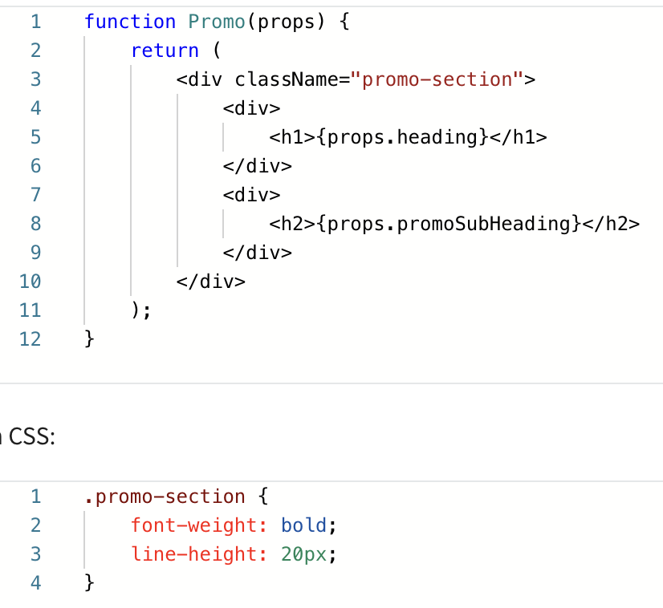

# React

build more **modular** apps; 

To make a browser understand react code, it requires lots of technologies: **transpiler**,


<span style="color:red"> How to Create and Run the React project? </span>

npm init react-start . 

npm start 


## Transpiling JSX

Transpiling: the **JSX code** gets converted to **plain JavaScript code**.

```react
// Add a new function to the App component, in App.js
function Header(){
	return (<h1>Hello world</h1>); //Add a return statement, by an opening and a closing parenthesis.
}
function App() {
	return <Header />
}
```

### Folder and structures for a react project

- Node-modules: a repository for a project
- Public: assets that will be displayed in the page, like image files.
  - Index.html: it injects those updates in that same div of index HTML.
- Src: essential component files
- Root files:
  - Package-lock.json: hold all the dependencies with a specific versions. when run a project in another pc, it has all the information to help with rebuilding the those files reliably.
  - Package.json: lists information pertaining to my app.

### Build the app

What follows is the command to run in a suitable folder.

```react
npm init react-start .

npm start
// Build Components of Nav.js
function Nav() {
    return (
        <nav className="main-nav">
            <ul>
                <li>Home</li>
                <li>Articles</li>
                <li>About</li>
                <li>Contact</li>
            </ul>
        </nav>
    );
};

export default Nav;

// Use the className attribute in JSX
// Import the Nav component into the App component:
import Nav from "./Nav";
```

Kebab case: name variable where a developer replaces the spaces between words with a dash.

### Import components

**Modules:** stand-alone units of code that you can re-use again and again.

Stand-alone: you can add them to your programs, remove them and replace them with other modules and everything will still work. 独立的

```react
import Header from "header.js" // the file name extention is not required.
export default header

export fun // the function name to be different from the file name.
```


Components: small piece of function; Module: series of components.

### Props

- pass data between components;
  - Variable can contain many values
  - Groups related data of different types
  - Pass data from one component to another using Object property or Props
  - **Arguments** are passed like <u>HTML attributes</u>
  - Properties are contained;  can be accessed by 
- Keyword: props

- one direction (Parent to multiple Children)

### Disecting props

Use a transpiler to break JSX code to plain JavaScript.

```react
// A piece of JSX
function App() {
  return <h1>Hello there</h1>
}
// ----- Plain JavaScript
function App() {
  return React.createElement("h1", null, "hHllo there")
}
```

`React.createElement('h1, null, 'Hello there') ` It means that the `createElement` function receives three arguments:

1. The wrapping element to render
2. A null value -- Object value
3. The inner content that will go inside the wrapping element.

```react
function App() { 
  return (
    <div>
    <h1>Hello there</h1> 
    </div>
  )
}
//---------JavaScript 
function App() {
  return React.createElement(
  	'div', null, 
    React.createElement('h1', null, 'Hello there')
  );
}
```


### Pass parameters

```react
// App.js
function App() {
  return (
  	<div>
    	<Header name='Anna', color='red'/>
    </div>
  )
}
// Header.js
function Header(props) {
  return (
   	<h1>Hello, {props.name}, {props.color} </h1>;
  )
}
```


### Props and children

- Use **CSS style rules** from an external file and **add it to a component** <u>as an internal style</u>

Example: a bag to carry apples or pears. 

```react
function Apples(props) {
  return (
  	<div>
    	<h2>These apples are: {props.color}</h2>
      <p>The number is: {props.number}</p>
    </div>
  )
}
export default Apples

function Pears(props) {
  return (
  	<h2>I don't like pear, but {props.friend} does</h2>
  )
}
// Define a Bag to carry apples or pears
function Bag(props) {
    const bag = {
        padding: "20px",
        border: "1px solid gray",
        background: "#fff",
        margin: "20px 0"
    }
    return (
        <div style={bag}>
            {props.children} //gives the dive props.children as its content.
        </div>
    )
}
export default Bag

<Example>
  Hello there // "Hello there" is a child of Example JSX element.
</Example>
<Bag children={<Apples color="yellow" number='4'></Apples>} />
<Bag children={<Pears friend='Joyce'></Pears>} />
//=================================================
<Bag>
    <Apples color="yellow" number="5" /> // Apples is a prop of the Bag component. 属性.
</Bag>
<Bag>
    <Pears friend="Peter" />
</Bag>
// ==== Wrap a wide variety of components inside the Bag components.
```

Conclude: Wrap a wide variety of components inside the Bag component, using the children prop to achieve this.


### Styling JSX elements

- Using the `link` html element in the head of the index.html file
  - Using `href` attribute loads some CSS styles; 
  - Using `className` to access those css classes.
- Using inline styles.
  - A starting `Promo` component, 
  - Add come inine styles to it; Convert a CSS rule to a JavaScript object.
    - Css: hyphenated in plain CSS, font-size; Become camelCased: fontSize;
    - The value -- Become a string.

```react
<h1> {props.heading} </h1> //==>
<h1 style={color:"tomato", fontSize:"40px", fontWeight:"bold"}>{props.heading}</h1>
```




### JSX syntax and the arrow function

